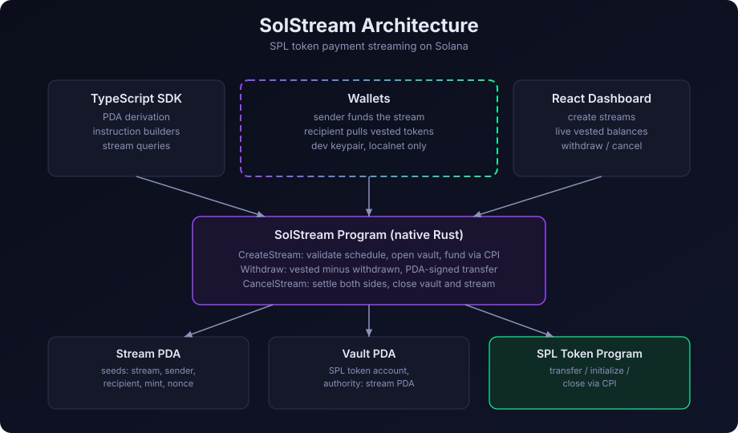

# SolStream Architecture

SolStream is a payment streaming protocol on Solana: a sender locks SPL tokens
into a stream, and the recipient withdraws them as they vest linearly over
time. The sender can cancel at any point; both sides are settled pro-rata and
the accounts are closed.



## Components

| Component | Stack | Role |
|---|---|---|
| Program | Native Rust, no framework | CreateStream, Withdraw, CancelStream |
| SDK | TypeScript, web3.js v1 | PDA derivation, instruction builders, queries |
| Dashboard | React, Vite | Create, monitor, withdraw, cancel |
| Tests | solana-program-test | Full lifecycle and failure cases |

## Accounts

**Stream PDA.** Seeds: `["stream", sender, recipient, mint, nonce:u64]`.
Holds the schedule and balances. 193 bytes, manual little-endian layout.

| Field | Type | Offset |
|---|---|---|
| sender, recipient, mint, vault | Pubkey | 0, 32, 64, 96 |
| deposited, withdrawn | u64 | 128, 136 |
| rate_per_sec | u64 | 144 |
| start_ts, end_ts, cliff_ts | i64 | 152, 160, 168 |
| nonce | u64 | 176 |
| bump | u8 | 184 |

**Vault PDA.** Seeds: `["vault", stream]`. An SPL token account whose
authority is the stream PDA. All token movement goes through program-signed
CPIs, so only the program can move funds.

## Instructions

### CreateStream

Accounts: sender (signer, payer), stream PDA, vault PDA, recipient, mint,
sender token account, token program, system program, rent sysvar.

1. Validate the schedule: `end > start`, `cliff` inside `[start, end]`,
   `amount > 0`, `rate > 0`, and `rate * duration == amount` with checked
   math. Reject anything else.
2. Verify both PDAs re-derive from the seeds.
3. Create the stream account and the vault token account via the system
   program, initialize the vault with the stream PDA as authority.
4. Transfer `amount` from the sender into the vault via the token program.

### Withdraw

Accounts: recipient (signer), stream, vault, recipient token account, token
program, clock sysvar.

1. The caller must be the recipient.
2. Read the clock. Before the cliff, nothing is vested.
3. `vested = min(rate * elapsed, deposited)`, `payout = vested - withdrawn`.
   Zero payout is rejected.
4. PDA-signed token transfer of `payout` to the recipient, then persist the
   new `withdrawn` total.

### CancelStream

Accounts: sender (signer), stream, vault, recipient token account, sender
token account, token program, clock sysvar.

1. The caller must be the sender.
2. Pay the recipient `vested - withdrawn`, return `deposited - vested` to
   the sender.
3. Close the vault with the token program, sending its rent to the sender.
4. Drain the stream account lamports to the sender and zero its data.

## Vesting math

```
vested(now) = 0                                         when now < cliff
vested(now) = min(rate_per_sec * (now - start), amount) otherwise
```

All arithmetic uses checked operations. Overflow fails the instruction
instead of wrapping.

## Trust notes

- The program never holds SOL and never moves tokens except through the
  vault it controls.
- Time comes from the clock sysvar. Slot timestamps are approximate, so
  vesting boundaries have slot-level granularity.
- This code is tested on a local validator only and has not been audited.
  Do not use it with real funds.
